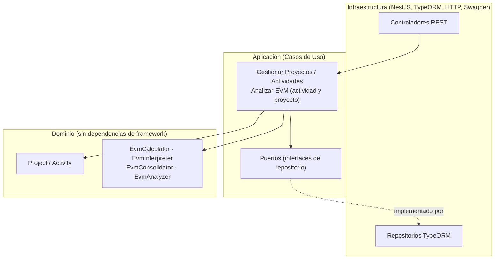

# EVM Monitor

Herramienta interna para que líderes de proyecto registren el avance de sus actividades y
sepan, en tiempo real, si un proyecto va bien o mal en términos de cronograma y
presupuesto — usando **Valor Ganado (Earned Value Management, EVM)**, el estándar del
PMI para cuantificar esa relación entre "cuánto he gastado" y "cuánto he avanzado
realmente".

> Un proyecto puede haber gastado el 60% del presupuesto habiendo completado solo el
> 40% del trabajo — eso es una señal de alerta que un simple listado de gastos no
> muestra. EVM la cuantifica exactamente.

## Tabla de contenido

- [Qué hace la aplicación](#qué-hace-la-aplicación)
- [Arquitectura](#arquitectura)
- [Stack tecnológico](#stack-tecnológico)
- [Estructura del repositorio](#estructura-del-repositorio)
- [Cómo levantar el proyecto](#cómo-levantar-el-proyecto)
  - [Opción A: Docker (recomendada)](#opción-a-docker-recomendada)
  - [Opción B: Desarrollo local sin Docker](#opción-b-desarrollo-local-sin-docker)
- [Variables de entorno](#variables-de-entorno)
- [Documentación de la API (Swagger)](#documentación-de-la-api-swagger)
- [El modelo EVM, en breve](#el-modelo-evm-en-breve)
- [Pruebas](#pruebas)
- [Migraciones de base de datos](#migraciones-de-base-de-datos)

## Qué hace la aplicación

- **Gestión de proyectos y actividades**: alta, consulta, actualización y eliminación de
  ambos, con las reglas de negocio propias del dominio (nombres no vacíos, presupuestos y
  porcentajes válidos).
- **Análisis EVM por actividad**: PV, EV, AC, CV, SV, CPI, SPI, EAC y VAC calculados
  automáticamente, con su interpretación en lenguaje llano ("vas atrasado", "estás por
  encima del presupuesto") y un estado general (saludable / en riesgo / crítico).
- **Análisis consolidado por proyecto**: los mismos indicadores sumados a nivel de todas
  las actividades de un proyecto (método de consolidación estándar del PMI).
- **Dashboard ejecutivo**: una sola pantalla por proyecto con resumen ejecutivo, alertas,
  KPIs, gráficos profesionales (Recharts) y la gestión de actividades integrada — todo se
  actualiza automáticamente después de cualquier cambio, sin recargar la página.
- **Comparación PV/EV/AC por actividad**: para identificar de un vistazo qué actividades
  llevan sobrecosto o retraso dentro de un mismo proyecto.
- **Documentación OpenAPI/Swagger** de toda la API, sincronizada con la implementación
  real (ver [Documentación de la API](#documentación-de-la-api-swagger)).

## Arquitectura

El backend sigue **Arquitectura Limpia / Hexagonal**, con el dominio EVM completamente
libre de dependencias de framework:



- **Dominio**: entidades (`Project`, `Activity`), value objects (`ActivityProgressData`) y
  el motor EVM puro (fórmulas, interpretación, consolidación) — sin NestJS, sin SQL, 100%
  testeable de forma aislada.
- **Aplicación**: casos de uso que orquestan dominio + repositorios (a través de puertos),
  con acoplamiento ligero a NestJS solo para inyección de dependencias.
- **Infraestructura**: controladores REST, entidades y repositorios TypeORM, filtro global
  de excepciones, documentación Swagger — es la única capa que conoce HTTP y PostgreSQL.

El frontend sigue una separación por responsabilidad similar: `api/` (HTTP), `types/`
(contratos), `components/` (UI reutilizable), `screens/` (pantallas + su hook de estado).

## Stack tecnológico

| | Backend | Frontend |
|---|---|---|
| Lenguaje | TypeScript | TypeScript |
| Framework | NestJS 11 | React 19 + Vite |
| Persistencia | PostgreSQL 16 + TypeORM (migraciones, sin `synchronize`) | — |
| Validación | class-validator / class-transformer | validación en formularios propios |
| Documentación | OpenAPI / Swagger (`@nestjs/swagger`) | — |
| Estilos | — | Tailwind CSS v4 |
| Gráficos | — | Recharts |
| Enrutamiento | — | React Router 7 |
| Pruebas unitarias | Jest | Vitest + Testing Library |
| Pruebas de integración | Jest + Supertest (contra Postgres real) | — |
| Pruebas E2E | — | Playwright |
| Contenedores | Docker / Docker Compose | Docker / Docker Compose |

## Estructura del repositorio

```
projects/
├── docker-compose.yml       # Orquesta postgres + backend + frontend
├── .env / .env.example      # Variables compartidas por docker-compose
├── backend/
│   ├── src/
│   │   ├── domain/          # Entidades, value objects y motor EVM (sin framework)
│   │   ├── application/     # Casos de uso + puertos (interfaces de repositorio)
│   │   ├── infrastructure/  # Controladores, entidades TypeORM, repos, filtros, Swagger
│   │   └── main.ts          # Composition root (CORS, ValidationPipe, Swagger)
│   ├── test/                 # Pruebas e2e (Jest + Supertest, contra Postgres real)
│   └── Dockerfile
└── frontend/
    ├── src/
    │   ├── api/              # Cliente HTTP y llamadas a cada recurso
    │   ├── types/             # Contratos TypeScript espejo de los DTOs del backend
    │   ├── components/        # UI reutilizable (indicadores, gráficos, layout, ui/)
    │   ├── screens/            # Pantallas, cada una con su hook de datos
    │   └── utils/               # Formato de números, paleta de colores por estado, etc.
    ├── e2e/                      # Pruebas Playwright (navegador real)
    └── Dockerfile
```

## Cómo levantar el proyecto

### Opción A: Docker (recomendada)

Requiere [Docker](https://www.docker.com/) y Docker Compose (incluido en Docker Desktop).

```bash
# Desde la raíz del repositorio
cp .env.example .env      # valores por defecto ya funcionan tal cual
docker compose up --build
```

Esto levanta tres contenedores:

| Servicio | URL | Descripción |
|---|---|---|
| `postgres` | `localhost:5432` | Base de datos (con healthcheck) |
| `backend` | http://localhost:3000 | API REST — corre las migraciones automáticamente al iniciar |
| `frontend` | http://localhost:5173 | Aplicación web |

La documentación interactiva de la API queda disponible en
**http://localhost:3000/api-docs**.

Para detener todo: `docker compose down` (agrega `-v` si además quieres borrar los datos
de Postgres).

### Opción B: Desarrollo local sin Docker

Requiere Node.js 22+ y una instancia de PostgreSQL accesible (puedes levantar solo la
base de datos con Docker: `docker compose up -d postgres`).

```bash
# 1) Backend
cd backend
cp .env.example .env        # ajusta DB_HOST=localhost si usas el postgres de Docker
npm install
npm run migration:run       # crea el esquema (proyectos y actividades)
npm run start:dev           # http://localhost:3000

# 2) Frontend (en otra terminal)
cd frontend
cp .env.example .env
npm install
npm run dev                 # http://localhost:5173
```

## Variables de entorno

Definidas en el `.env` de la raíz (usadas por `docker-compose.yml`):

| Variable | Descripción | Valor por defecto |
|---|---|---|
| `POSTGRES_USER` / `POSTGRES_PASSWORD` / `POSTGRES_DB` | Credenciales de la base de datos | `evm_user` / `evm_password` / `evm_db` |
| `POSTGRES_PORT` | Puerto publicado de Postgres en el host | `5432` |
| `BACKEND_PORT` | Puerto publicado del backend en el host | `3000` |
| `FRONTEND_URL` | Origen permitido por CORS en el backend | `http://localhost:5173` |
| `FRONTEND_PORT` | Puerto publicado del frontend en el host | `5173` |
| `VITE_API_BASE_URL` | URL del backend que usa el navegador (no la red interna de Docker) | `http://localhost:3000` |

`backend/.env` y `frontend/.env` tienen las mismas variables para cuando se ejecutan
**sin** Docker (ahí `DB_HOST` sí es `localhost`, no `postgres`, porque no hay red interna
de contenedores).

## Documentación de la API (Swagger)

Con el backend corriendo, la documentación completa e interactiva está en:

**http://localhost:3000/api-docs**

Agrupada en tres secciones (`Proyectos`, `Actividades`, `Análisis EVM`), con cada
endpoint documentado: parámetros, cuerpo de petición/respuesta, códigos HTTP posibles y
ejemplos reales. Incluye "Try it out" para probar peticiones reales contra el backend
directamente desde el navegador.

Todos los errores de la API siguen un contrato uniforme:

```json
{
  "categoria": "no_encontrado",
  "mensaje": "No se encontró un proyecto con el identificador \"...\".",
  "referencia": "b2a1f6d4-9e3a-4c7e-8b1a-6f2d3e4c5a6b",
  "detalles": ["opcional: presente solo cuando hay más de una violación"]
}
```

## El modelo EVM, en breve

Por cada actividad se registran cuatro datos: presupuesto planificado (**BAC**),
porcentaje de avance planificado, porcentaje de avance real y costo real incurrido
(**AC**). A partir de ahí, el backend calcula:

| Indicador | Significa | Fórmula |
|---|---|---|
| **PV** | Valor planificado a la fecha | `% planificado × BAC` |
| **EV** | Valor ganado según lo realmente avanzado | `% real × BAC` |
| **CV** | Variación de costo (¿gasté más o menos de lo que valía el trabajo hecho?) | `EV − AC` |
| **SV** | Variación de cronograma (¿voy adelantado o atrasado?) | `EV − PV` |
| **CPI** | Eficiencia de costo (1.00 = en presupuesto) | `EV / AC` |
| **SPI** | Eficiencia de cronograma (1.00 = a tiempo) | `EV / PV` |
| **EAC** | Costo estimado al finalizar, proyectando el desempeño actual | `BAC / CPI` |
| **VAC** | Variación estimada al finalizar | `BAC − EAC` |

CPI y SPI (y lo que dependen de ellos) son `null` cuando su divisor es cero — un costo
real de \$0 o un avance planificado de 0% no es un error, es un caso legítimo del dominio,
y así se documenta y se prueba en todo el proyecto.

El **consolidado por proyecto** no promedia los CPI/SPI de cada actividad: suma los
valores base (BAC, PV, EV, AC) de todas las actividades y recalcula los ratios sobre esos
totales — el método estándar del PMI para llevar el análisis de actividad a nivel de
proyecto.

## Pruebas

```bash
# Backend — unitarias (dominio + aplicación, sin base de datos)
cd backend && npm test

# Backend — integración (requiere Postgres real; docker compose up -d postgres)
cd backend && npm run test:e2e

# Frontend — unitarias e integración de componentes
cd frontend && npm test

# Frontend — end-to-end en navegador real (requiere backend + frontend corriendo)
cd frontend && npm run test:e2e
```

## Migraciones de base de datos

El esquema se gestiona por migraciones de TypeORM (`synchronize` está deshabilitado
deliberadamente):

```bash
cd backend
npm run migration:generate -- src/infrastructure/persistence/migrations/NombreDeLaMigracion
npm run migration:run
npm run migration:revert
```
